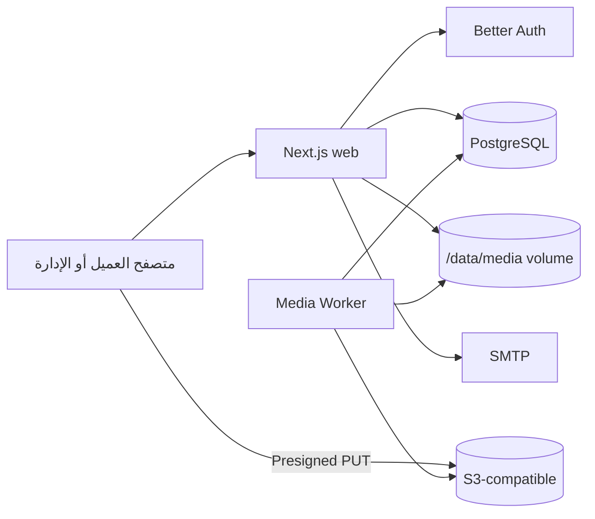
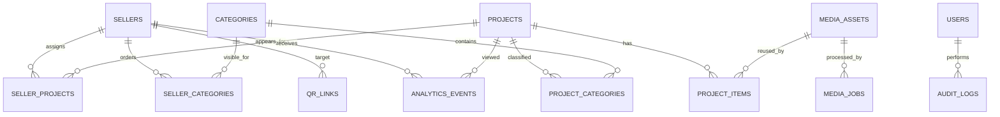

# المعمارية

## المكونات

Server Components هي الافتراضية. Client Components مقتصرة على المشاركة، العارض، before/after، تسجيل الدخول والرفع. الاستعلامات في `src/db/queries`، والتحقق والصلاحيات خادمية.

## نموذج البيانات

حذف البائع لا يحذف المشروع؛ العلاقات فقط cascade عند حذف السجل صراحة، بينما الواجهة تعتمد soft delete. حذف media المرتبط `restrict`.

## التدفقات

### المصادقة

طلب admin → Better Auth secure HttpOnly session → layout يتحقق من الجلسة → Server Action/Route Handler يعيد التحقق من permission → transaction وaudit log. التسجيل العام معطل.

### الرفع والمعالجة

الإدارة تطلب session → الخادم يتحقق من المستخدم والنوع والحجم ويولد object key → S3 presigned PUT أو local streaming PUT → finalize يتحقق من وجود الملف والحجم → transaction يحول asset إلى processing ويضيف job → worker يطالب بمهمة عبر `FOR UPDATE SKIP LOCKED` → Sharp أو ffprobe/ffmpeg → variants/poster → ready أو retry/failed.

### QR

`/q/[opaqueToken]` يتحقق من token والحالة والبائع → يسجل scan ويحدث العداد → يضع cookie source first-party → redirect داخلي إلى `/s/[slug]`. token لا يحتوي slug، فتغيير slug لا يكسر البطاقة ولا يسمح open redirect.

### سياق البائع وSEO

المشروع واحد في `/works/[slug]`. `advisor` يختار CTA ورسالة واتساب فقط. canonical وJSON-LD والمحتوى الأساسي يظلان للمشروع المركزي، لذلك لا توجد نسخ مفهرسة لكل بائع. draft/archived/inactive لا تظهر للعامة.

### التحليلات والكاش

الأحداث محددة بـZod، payload محدود، bots/prefetch مهملة، والمشاهدة deduplicated لفترة قصيرة حسب session first-party. لا تُخزن هوية أو IP خام أو User-Agent كامل. الأصول versioned/immutable، والمحتوى الديناميكي يُعاد التحقق منه بعد عمليات الإدارة.

## طوبولوجيا النشر

Coolify Application للويب وApplication اختيارية للworker من الصورة نفسها، وPostgreSQL Resource مستقلة على الشبكة الداخلية. S3 هو الخيار المفضل؛ local volume صالح لخادم واحد. migrations تعمل pre-deploy بحساب schema منفصل.
